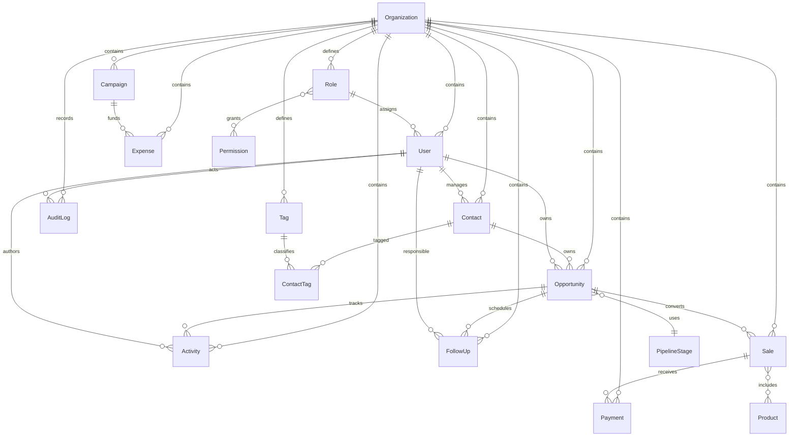

# Modelo de dominio CRM

## Relaciones principales

## Modelos

El esquema contiene únicamente `Organization`, `Role`, `Permission`, `User`, `Contact`, `Tag`, `ContactTag`, `Opportunity`, `PipelineStage`, `Activity`, `FollowUp`, `Product`, `Sale`, `Payment`, `Campaign`, `Expense` y `AuditLog`.

Todas las entidades usan UUID, timestamps y `deletedAt` nullable para soft delete. Las relaciones tenant-aware incluyen `organizationId`.

## Enumeraciones

- `PipelineStageCategory`: `OPEN`, `WON`, `ARCHIVED`.
- `ActivityType`: `MESSAGE`, `NOTE`, `DEMO`, `FOLLOWUP`, `PAYMENT`, `SALE`, `STATUS_CHANGE`, `SYSTEM`.
- `UserStatus`, `FollowUpPriority`, `FollowUpStatus`, `SaleStatus` y `PaymentStatus` completan los estados operativos del dominio.

Las etapas del pipeline son datos configurables por organización; los nombres del pipeline inicial están únicamente en el seed.

## Auditoría e índices

`AuditLog` conserva actor, acción, tabla, registro, valores anterior/nuevo, IP y fecha. El esquema indexa las claves de tenant, estado, teléfono normalizado, país, campaña, usuario y timestamps de creación, además de las claves de relación principales.
