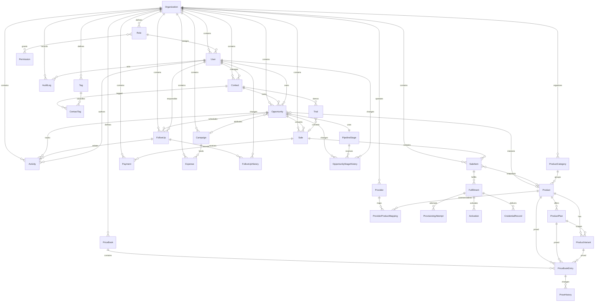
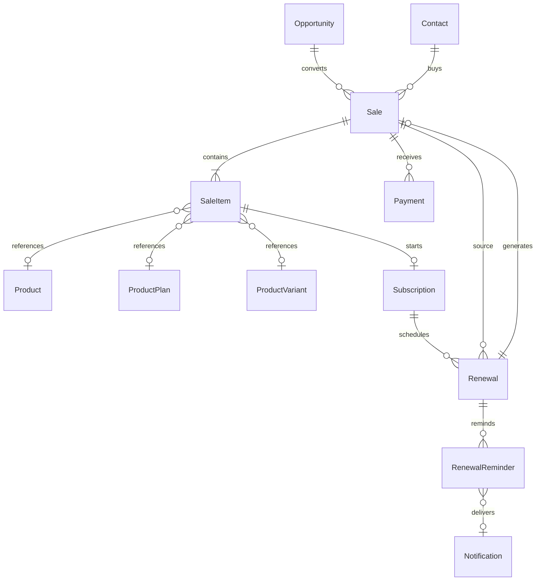

# Modelo de dominio CRM

## Gobernanza arquitectónica

Architecture v1.0 — Commercial Core está **APPROVED / FROZEN** desde el commit
`d4ee72096edb6d691675a8a518a6ee3aeb610a18`, con veredicto **APPROVED WITH
FOLLOW-UP**. El mapa oficial de versiones, dominios y decisiones está en el
[SuperFlash Platform Architecture Book](architecture/README.md).

Revenue Intelligence pertenece a Architecture v2.0 y permanece como
**ROADMAP / NOT IMPLEMENTED**. Las plataformas externas serán futuras fuentes
de tráfico; la inteligencia del negocio no se trasladará fuera de SuperFlash
Platform.

## Operations and Fulfillment (Architecture v1.1)

La operación posterior a la venta se modela con `Provider`,
`ProviderProductMapping`, `Fulfillment`, `ProvisioningAttempt`,
`CredentialRecord`, `Trial` y `Activation`. Cada entidad incluye
`organizationId` y relaciones compuestas por tenant. `Fulfillment` nace de un
`SaleItem` confirmado, conserva el snapshot recibido y usa una `identityKey`
para impedir duplicados por ciclo. `ProvisioningAttempt` es historial
append-only y los adaptadores Manual/Mock están detrás de un contrato estable.

`CredentialRecord` almacena únicamente ciphertext AES-256-GCM. Las respuestas
son enmascaradas por defecto; el revelado requiere permiso explícito, está
limitado por rate limit y genera auditoría sin el secreto.

`Trial` conserva un snapshot comercial y puede convertirse en una nueva `Sale`
sin modificar su historial. `Activation` es el resultado operativo de un
fulfillment completado y su índice parcial evita activaciones activas
duplicadas.

## Comercial endurecido

`Sale` es el acuerdo comercial, `Payment` el movimiento financiero, `Subscription` el ciclo recurrente y `Renewal` la identidad histórica de cada periodo. `SaleItem`, `Subscription` y `Renewal` persisten snapshots versionados; no se consulta el catálogo vivo para reconstruir acuerdos históricos.

`OutboxEvent` se persiste dentro de la misma transacción que cambia el agregado. Un procesador asíncrono entrega eventos con reintentos y `eventId`; los consumidores deben ser idempotentes. `requestId` se propaga por HTTP, AuditLog, Activity, Outbox y logs.

PostgreSQL protege fórmulas de importes, no negatividad, límites de reembolso, ciclos `CUSTOM`, orden de periodos y append-only de AuditLog/Activity. Las invariantes que requieren varias filas, como el balance y la política de cancelación, permanecen en servicios transaccionales bajo lock.

## Relaciones principales

## Modelos

El esquema contiene `Organization`, `Role`, `Permission`, `User`, `Contact`, `Tag`, `ContactTag`, `Opportunity`, `OpportunityStageHistory`, `PipelineStage`, `Activity`, `FollowUp`, `FollowUpHistory`, `ProductCategory`, `Product`, `ProductPlan`, `ProductVariant`, `PriceBook`, `PriceBookEntry`, `PriceHistory`, `Sale`, `SaleItem`, `Payment`, `Campaign`, `Expense`, `AuditLog`, `OutboxEvent`, `Provider`, `ProviderProductMapping`, `Fulfillment`, `ProvisioningAttempt`, `CredentialRecord`, `Trial` y `Activation`.

Todas las entidades tenant-aware usan UUID, timestamps y `organizationId`. El soft delete se representa mediante `deletedAt`, excepto `AuditLog`, que es append-only e inmutable.

## Oportunidades y ventas

`Opportunity.expectedAmount` es una proyección comercial antes del cierre. `OpportunityStageHistory` es append-only y registra la etapa anterior, nueva etapa, actor, motivo y fecha. `Sale.subtotal` y `Sale.total` representan importes confirmados de una venta. Una oportunidad puede tener como máximo una venta activa principal; las ventas canceladas históricas se conservan.

`SaleItem` es explícito y conserva `productNameSnapshot`, `skuSnapshot`, `quantity`, `unitPrice`, `total` y `currency`. Los snapshots no cambian cuando se actualiza el producto de referencia.

## Enumeraciones

- `PipelineStageCategory`: `OPEN`, `WON`, `LOST`. El archivado es independiente y vive en `Opportunity.archivedAt`.
- `ActivityType`: `MESSAGE`, `NOTE`, `DEMO`, `FOLLOWUP`, `PAYMENT`, `SALE`, `STATUS_CHANGE`, `SYSTEM`.
- `FollowUpStatus`: `PENDING`, `COMPLETED`, `RESCHEDULED`, `CANCELLED`.
- `FollowUpHistoryAction`: `CREATED`, `UPDATED`, `COMPLETED`, `CANCELLED`, `RESCHEDULED`, `ASSIGNEE_CHANGED`, `ARCHIVED`, `RESTORED`.
- `UserStatus`, `FollowUpPriority`, `SaleStatus` y `PaymentStatus` completan los estados operativos.
- `ProductType`, `FulfillmentMode`, `CustomerSegment`, `BillingPeriodUnit`, `ProductStatus` y `PriceBookStatus` gobiernan el catálogo y la resolución de precios.

Las etapas del pipeline son configurables por organización. Los nombres iniciales existen únicamente en el seed.

`PipelineStage.systemKey` es opcional y estable. Solo las ocho etapas oficiales lo reciben desde seed; las etapas personalizadas quedan con `NULL`. Las consultas de Mi Día usan este identificador, no el nombre visible.

`FollowUpHistory` no tiene `updatedAt` ni `deletedAt`: la aplicación solo inserta eventos. `FollowUp` referencia a oportunidad, responsable, actores y reemplazo mediante claves compuestas con `organizationId`, evitando relaciones cruzadas entre tenants.

El estado público de una oportunidad se deriva en servidor: `ARCHIVED` cuando existe `archivedAt`, `WON` o `LOST` según la categoría de su etapa y `OPEN` en los demás casos.

## Integridad multiempresa

Cada entidad tenant-aware expone `@@unique([organizationId, id])`. Las relaciones sensibles referencian pares `(organizationId, id)`, de modo que una fila de una organización no puede apuntar a una fila de otra organización, incluso mediante SQL directo.

Teléfonos normalizados de contactos, SKU de productos y `opportunityId` de ventas activas usan índices únicos parciales en PostgreSQL. PostgreSQL permite múltiples valores `NULL` en los índices únicos compuestos; los índices parciales además excluyen filas eliminadas o ventas canceladas.

Los slugs/códigos activos del catálogo, el default de price books y las combinaciones activas de entradas
de precio también están protegidos por índices parciales. La combinación de entrada incluye el periodo
(`validFrom`, `validUntil`) y PostgreSQL usa `NULLS NOT DISTINCT` para los límites abiertos. Los montos
del catálogo son `Decimal(18,2)`; `PriceHistory` es append-only y conserva cada alta o modificación de
precio. `PriceBook.priority` está limitada a `-10000..10000`.

## Auditoría y checks

`AuditLog` conserva actor, acción, tabla, registro, valores anterior/nuevo, IP y fecha. No tiene `updatedAt` ni `deletedAt`; la aplicación debe tratarlo como append-only y nunca actualizarlo o eliminarlo.

## Communications and Automations (Architecture v1.2)

`MessageTemplate` mantiene el contenido, canal, variables detectadas y versión.
`AutomationRule` define un trigger, condiciones JSON declarativas y una lista
ordenada de `AutomationAction`. `AutomationExecution` es la cola durable e
idempotente de cada regla/evento; `AutomationExecutionAction` conserva el
resultado independiente de cada acción para permitir retries sin repetir las
acciones ya completadas. `Notification` representa el centro interno por
usuario y utiliza los estados `UNREAD`, `READ` y `ARCHIVED`.

El motor se activa al procesar eventos del Transactional Outbox, nunca desde
una llamada externa dentro de la transacción de negocio. Todas las filas
incluyen `organizationId` y las claves compuestas evitan referencias cruzadas
entre tenants. Las condiciones y configuraciones de acciones se interpolan
con paths propios; no se ejecutan expresiones ni plantillas como código.

La migración agrega checks para órdenes positivas, cantidades mayores que cero y montos no negativos. En pagos valida `netAmount <= grossAmount`.

## Núcleo comercial (Sprint 8–11)

`Sale` representa el acuerdo comercial y sus `SaleItem` conservan un snapshot JSON más campos tipados del catálogo. El snapshot es la fuente histórica de la venta, por lo que los cambios posteriores del catálogo no alteran el acuerdo.

`Payment` guarda importes bruto, comisión, neto y reembolsado. El saldo se calcula como `Sale.total - sum(Payment.netAmount - Payment.refundedAmount)` únicamente sobre pagos confirmados o reembolsados; no existen columnas derivadas `remainingBalance` ni `paidAmount`.

`Subscription` nace de un `SaleItem` y conserva su snapshot. `Renewal` pertenece a una suscripción y a la venta fuente; al pagarse crea una venta nueva con sus propios ítems y pago, sin modificar la venta anterior.

`Renewal.workflowStatus` representa el proceso manual de gestión del cliente y
no reemplaza `Renewal.status`, que conserva el estado financiero del ciclo.
`RenewalReminder` identifica cada recordatorio por organización, ciclo y tipo;
su enlace a `Notification` es idempotente mediante una huella de deduplicación.

Las confirmaciones de ventas, confirmaciones de pagos, creación/pago de renovaciones y conversiones de oportunidades bloquean la fila agregada con `FOR UPDATE`. Las operaciones se mantienen dentro de transacciones cortas y escriben eventos durables en Outbox dentro del commit.

## Revenue Intelligence (Architecture v2.0 Phase 1)

Revenue Intelligence no agrega entidades transaccionales al modelo. Lee las
tablas del núcleo mediante consultas tenant-scoped y tres materialized views:
`revenue_sales_daily`, `revenue_subscriptions_monthly` y
`revenue_funnel_daily`. Son agregados derivados, refrescables y descartables;
los snapshots de SaleItem y Subscription continúan siendo la fuente histórica
del acuerdo.

La capa analítica agrupa monedas, nunca las convierte, y devuelve únicamente
proyecciones autorizadas por `reports.read`. La futura atribución y el
Analytical Event Store consumirán eventos durables del Transactional Outbox sin
alterar estas entidades.

## Financial Intelligence Phase 1

`ExpenseCategory` clasifica egresos por organización. `Expense` conserva el
histórico de cada gasto, incluyendo moneda, método de pago y categoría.
`RecurringExpense` es la plantilla operativa; cada ocurrencia materializada
usa `organizationId + recurringExpenseId + occurrenceKey` como identidad
idempotente. Pausar o finalizar una plantilla no modifica ocurrencias pasadas.

El dashboard financiero es una proyección de lectura: suma ventas `CONFIRMED`
o `FULFILLED` y gastos no eliminados por período y moneda. No persiste saldos
derivados ni modifica Sales, Payments o Revenue Intelligence.

## Executive Intelligence & CRM Maturity

Las vistas ejecutivas son proyecciones read-side sobre las entidades existentes;
no introducen un segundo modelo de ventas ni un almacén analítico transaccional.
`Opportunity` conserva ahora `probability` (0–100) y `priority` (`LOW`,
`NORMAL`, `HIGH`, `URGENT`) para priorización operativa. `weightedValue` se
calcula al leer y no se persiste. Customer 360, Agenda Operativa, búsqueda
global y Business Intelligence aplican aislamiento por `organizationId` y
excluyen secretos y campos internos.
