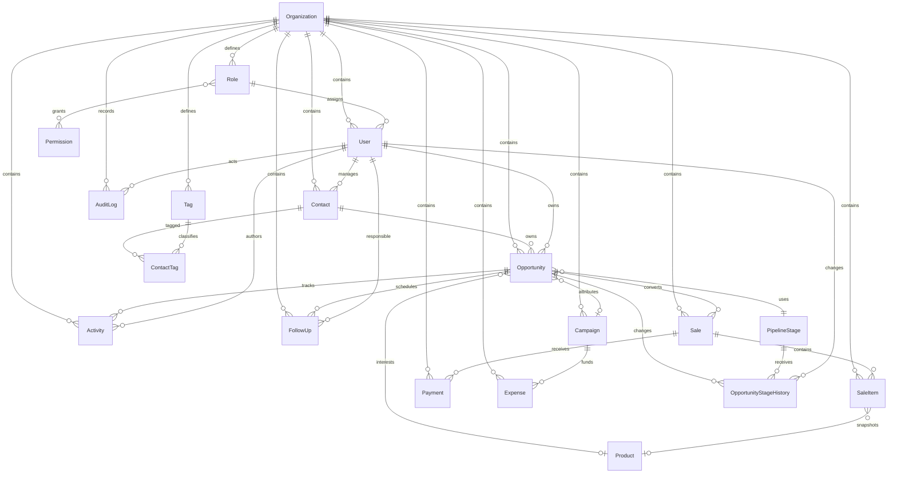

# Modelo de dominio CRM

## Relaciones principales

## Modelos

El esquema contiene `Organization`, `Role`, `Permission`, `User`, `Contact`, `Tag`, `ContactTag`, `Opportunity`, `OpportunityStageHistory`, `PipelineStage`, `Activity`, `FollowUp`, `Product`, `Sale`, `SaleItem`, `Payment`, `Campaign`, `Expense` y `AuditLog`.

Todas las entidades tenant-aware usan UUID, timestamps y `organizationId`. El soft delete se representa mediante `deletedAt`, excepto `AuditLog`, que es append-only e inmutable.

## Oportunidades y ventas

`Opportunity.expectedAmount` es una proyección comercial antes del cierre. `OpportunityStageHistory` es append-only y registra la etapa anterior, nueva etapa, actor, motivo y fecha. `Sale.subtotal` y `Sale.total` representan importes confirmados de una venta. Una oportunidad puede tener como máximo una venta activa principal; las ventas canceladas históricas se conservan.

`SaleItem` es explícito y conserva `productNameSnapshot`, `skuSnapshot`, `quantity`, `unitPrice`, `total` y `currency`. Los snapshots no cambian cuando se actualiza el producto de referencia.

## Enumeraciones

- `PipelineStageCategory`: `OPEN`, `WON`, `LOST`. El archivado es independiente y vive en `Opportunity.archivedAt`.
- `ActivityType`: `MESSAGE`, `NOTE`, `DEMO`, `FOLLOWUP`, `PAYMENT`, `SALE`, `STATUS_CHANGE`, `SYSTEM`.
- `FollowUpStatus`: `PENDING`, `COMPLETED`, `RESCHEDULED`, `CANCELLED`.
- `UserStatus`, `FollowUpPriority`, `SaleStatus` y `PaymentStatus` completan los estados operativos.

Las etapas del pipeline son configurables por organización. Los nombres iniciales existen únicamente en el seed.

El estado público de una oportunidad se deriva en servidor: `ARCHIVED` cuando existe `archivedAt`, `WON` o `LOST` según la categoría de su etapa y `OPEN` en los demás casos.

## Integridad multiempresa

Cada entidad tenant-aware expone `@@unique([organizationId, id])`. Las relaciones sensibles referencian pares `(organizationId, id)`, de modo que una fila de una organización no puede apuntar a una fila de otra organización, incluso mediante SQL directo.

Teléfonos normalizados de contactos, SKU de productos y `opportunityId` de ventas activas usan índices únicos parciales en PostgreSQL. PostgreSQL permite múltiples valores `NULL` en los índices únicos compuestos; los índices parciales además excluyen filas eliminadas o ventas canceladas.

## Auditoría y checks

`AuditLog` conserva actor, acción, tabla, registro, valores anterior/nuevo, IP y fecha. No tiene `updatedAt` ni `deletedAt`; la aplicación debe tratarlo como append-only y nunca actualizarlo o eliminarlo.

La migración agrega checks para órdenes positivas, cantidades mayores que cero y montos no negativos. En pagos valida `netAmount <= grossAmount`.
